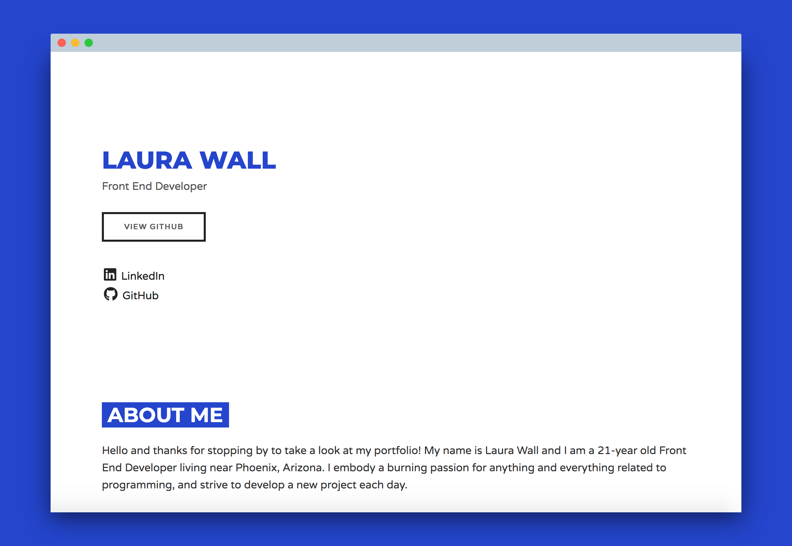

# laura.ga (<a href="https://www.laura.ga" target="_blank">LINK</a>)

GitHub repository for my portfolio website. Feel free to take a look through my code.

# Technologies Used

<ul>
  <li>HTML5</li>
  <li>CSS3</li>
  <li><a href="http://getskeleton.com/">Skeleton CSS</a></li>
  <li><a href="https://necolas.github.io/normalize.css/">Normalize CSS</a></li>
  <li><a href="https://autoprefixer.github.io/">Autoprefixer CSS</a></li>
  <li><a href="https://fontawesome.com/">Font Awesome</a></li>
  <li><a href="https://www.10bestdesign.com/dirtymarkup/">DirtyMarkup Formatter</a></li>
  <li><a href="https://fonts.google.com/">Google Font CDN</a></li>
  <li><a href="http://brackets.io/">Brackets.io</a></li>
</ul>

# Screencap

# Credits

N/A.
